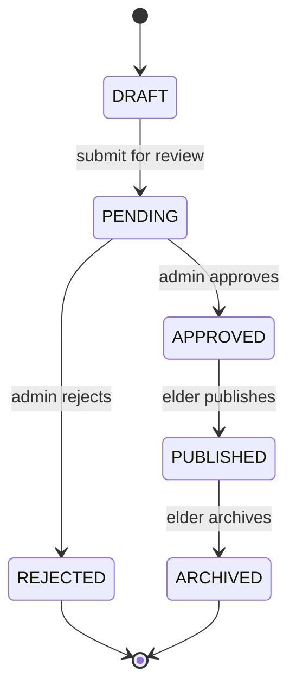

# Legacy Lens — Story Status Lifecycle Implementation Plan

> Status: **not implemented yet** — blocked on a design discussion with the Admin component owner (approve/reject is an admin-dashboard action, and no admin-side moderation controller exists anywhere in the backend today). This doc captures the intended design so it isn't lost, and gives a ready-to-follow implementation breakdown for once that discussion happens and the admin branch is merged.

## Why this doc exists

While debugging why some stories didn't show up in the mobile app, three rows in the `stories` table turned out to have `status = 'REJECTED'` or `status = 'ARCHIVED'` — values the current `StoryStatus` enum (`backend/src/main/java/lk/ac/sliit/legacylens/stories/entity/StoryStatus.java`) doesn't define. Hibernate throws `IllegalArgumentException: No enum constant ...StoryStatus.REJECTED` when it hits one of these rows, which silently fails the *entire* story list for whichever user owns that row — not just the bad row. Those rows aren't corrupt test data, though — they're exactly the two admin outcomes described below, entered by hand ahead of the real workflow existing. That coincidence is what prompted writing this design down properly instead of just patching the data.

**Immediate unblock** (not this plan — a separate, smaller fix): reset those 3 rows to a currently-valid status (`PENDING`) so the app stops erroring, without pre-empting the design below. Do this independently whenever convenient.

---

## Target lifecycle (as specified)

| State | Entered when | Who triggers it | What can happen next |
|---|---|---|---|
| `DRAFT` | Story written and saved, not yet submitted | Elder | Submit → `PENDING` |
| `PENDING` | Submitted for admin approval | Elder (submits) | Admin decides → `APPROVED` or `REJECTED` |
| `APPROVED` | Admin approved it | Admin | Elder can publish → `PUBLISHED`, or edit (see open question below) |
| `REJECTED` | Admin rejected it | Admin | Terminal — **cannot** be published (see open question below) |
| `PUBLISHED` | Elder published an approved story | Elder | Elder can archive → `ARCHIVED` |
| `ARCHIVED` | A published story was archived | Elder | Terminal for now — **only reachable from `PUBLISHED`**, never directly from any other state |



This mirrors a pattern already in the codebase: `backend/src/main/java/lk/ac/sliit/legacylens/hiring/service/JobRequestStateMachine.java` is a small `EnumMap<Status, Set<Status>>` class that only knows which transitions are legal — no side effects. Its own doc comment already anticipates this exact need:

> "...kept as its own class (a separate one from the content module's future `ContentStateMachine`...)"

Build `StoryStateMachine` the same way, in `stories/service/`, so there's one source of truth for legal transitions that both the elder-facing and admin-facing services call into.

---

## Open questions for the Admin component owner

These are the reason this plan isn't being built yet — both change the admin API contract, so they need to be settled together, not assumed:

1. **Can a `REJECTED` story ever be edited and resubmitted?** The spec above says rejected content "can not be published" — but doesn't say whether it's a dead end forever, or whether editing a rejected story sends it back to `DRAFT`/`PENDING`. If admins are expected to leave a reason, that likely wants a `rejection_reason` column too (see Feature D below).
2. **Editing an `APPROVED` story** — the original description says the elder "can edit it — but you can not submit it, cause admin has to review it again." Read literally this is contradictory (edited but can't be resubmitted for the required re-review). Needs to be pinned down as one of:
   - (a) editing an approved story silently reverts it to `PENDING` (forces re-review automatically), or
   - (b) editing is disabled once `APPROVED` until a "resubmit" action exists (i.e. this isn't buildable yet), or
   - (c) editing is allowed freely post-approval and re-review is a later, separate feature.
3. **Where does the approve/reject action live?** No admin moderation controller exists in this backend yet (`grep -rl "admin" backend/src/main/java` turns up nothing for content/story moderation — only the unrelated `hiring`/`marketplace` packages). This needs to be a joint endpoint contract with whoever owns the admin dashboard branch (`feature/lakni/admin-dashboard-backend`), not something built unilaterally from the elder side.
4. **Can an `ARCHIVED` story be unarchived / republished?** Not mentioned in the spec — assume no (terminal) unless told otherwise.
5. **Naming: `REJECTED` vs `NEEDS_CHANGES`.** The mobile app already has a forward-compatible status in its own type union that isn't backed by the backend at all: `mobile-app/src/types/story.ts:12` — `'DRAFT' | 'PENDING' | 'PUBLISHED' | 'NEEDS_CHANGES'`, rendered by `StatusPill.tsx`. That was a guess made before this conversation. Recommend renaming the mobile type/label to `REJECTED` to match the backend enum and the DB data that already exists, rather than shipping two different words for the same concept.

---

## Baseline: what exists today

- `Story.status` (`backend/.../stories/entity/Story.java:47-49`) — `StoryStatus` enum, defaults to `PENDING` on creation. Enum currently only has `DRAFT, PENDING, PUBLISHED` (`StoryStatus.java:16-18`).
- `Story.publishedAt` (`Story.java:81-82`) already exists as a column but nothing ever sets it — forward-compatible groundwork already in place for Feature C below.
- `StoryController` (`backend/.../stories/controller/StoryController.java`) only has `create`, `listMine` (`GET /api/stories/me`), `getById`, generic field `update` (`PATCH /api/stories/{id}`), and `delete`. **No status-transition endpoints exist at all** — no submit, approve, reject, publish, or archive action.
- `StoryQueryServiceImpl` / `StorySpecifications` (`backend/.../contentcapture/`) power the paginated `GET /api/stories/mine` search used by My Stories (Screen 6) and already support an optional `status` filter predicate (`StorySpecifications.hasStatus`, `StorySpecifications.java:25-27`) — currently unused by the mobile client, but ready for "Drafts" / "Needs changes" style filtering later.
- Mobile `StoryReview` screen (`mobile-app/src/screens/content-capture/story_review.tsx`) only has two actions today: edit-and-save, and delete. No submit/publish/archive buttons exist yet.

---

## Implementation breakdown

Build in this order — each depends on the previous. **Do not start Feature C or D until the two open questions above are resolved with the admin owner** — everything else (A, B, and the `REJECTED`-terminal / `ARCHIVED`-terminal paths) is safe to build independently since it doesn't touch the admin contract.

### Feature A — Extend `StoryStatus` + add `StoryStateMachine`

**Entities/DTOs**:
- `StoryStatus.java`: add `APPROVED`, `REJECTED`, `ARCHIVED` alongside the existing `DRAFT, PENDING, PUBLISHED`.
- New `StoryStateMachine` (`stories/service/StoryStateMachine.java`), same shape as `JobRequestStateMachine`:
  ```java
  TRANSITIONS.put(DRAFT, Set.of(PENDING));
  TRANSITIONS.put(PENDING, Set.of(APPROVED, REJECTED));
  TRANSITIONS.put(APPROVED, Set.of(PUBLISHED)); // + PENDING if open question #2 resolves to (a)
  TRANSITIONS.put(REJECTED, Set.of()); // or Set.of(DRAFT) if open question #1 allows resubmission
  TRANSITIONS.put(PUBLISHED, Set.of(ARCHIVED));
  TRANSITIONS.put(ARCHIVED, Set.of());
  ```
- Add a `StoryTransitionException` (409 Conflict) thrown whenever a service method calls `stateMachine.canTransition(from, to)` and it returns `false` — every transition-changing service method must check this before mutating `status`, so an invalid transition (e.g. calling publish on a `DRAFT` story) fails loudly instead of corrupting state.

**Test suite**: `StoryStateMachineTest` — one `canTransition` assertion per legal edge in the diagram above, plus a few illegal ones (`PENDING → PUBLISHED` directly, `DRAFT → ARCHIVED` directly, etc.) asserting `false`.

---

### Feature B — Submit for review (`DRAFT → PENDING`)

**User story**: As an elder, once I've saved a draft I'm happy with, I want to submit it so an admin can review it.

**Implementation prompt**:
```
Add POST /api/stories/{storyId}/submit to StoryController. Delegate to
StoryService.submit(userId, storyId): verify the caller owns the story (author.id
== userId, else 404 — never leak existence of other users' stories), check
StoryStateMachine.canTransition(story.getStatus(), PENDING), throw
StoryTransitionException if illegal, otherwise set status = PENDING and save.
Return the updated StoryResponse.
```

**Test suite**: `submit_draftStory_movesToP ending`, `submit_alreadyPendingStory_throwsTransitionException`, `submit_notOwner_throws404`.

---

### Feature C — Admin approve / reject (`PENDING → APPROVED` / `REJECTED`) — **blocked on open questions #1 and #3**

**User story**: As an admin, I want to approve or reject a pending story so elders know whether it can be published.

**Entities/DTOs**: Likely needs `rejection_reason` (nullable TEXT) added to `Story` if question #1 confirms admins leave feedback — surface it in `StoryResponse` so the elder-facing app can show *why* something was rejected, matching the "honoring, not corporate" tone already established for these screens rather than a bare status change.

**Implementation prompt** (sketch — finalize the URL/package once the admin owner's controller location is agreed):
```
Add an admin-gated endpoint (exact path/package TBD with the admin dashboard
owner — likely something like POST /api/admin/stories/{storyId}/approve and
.../reject under a new admin-facing controller, secured by an admin role
check, NOT under StoryController which is scoped to "the caller's own
stories" only). Delegate to StoryModerationService.approve/reject(adminId,
storyId[, reason]), using the same StoryStateMachine.canTransition guard as
Feature B.
```

**Test suite**: `approve_pendingStory_movesToApproved`, `reject_pendingStory_movesToRejectedWithReason`, `approve_alreadyApprovedStory_throwsTransitionException`, `approve_nonAdminCaller_returns403`.

---

### Feature D — Publish (`APPROVED → PUBLISHED`)

**User story**: As an elder, once my story is approved, I want to publish it so it becomes visible.

**Implementation prompt**:
```
Add POST /api/stories/{storyId}/publish to StoryController. Same ownership +
StoryStateMachine guard pattern as Feature B. On success, set status =
PUBLISHED and publishedAt = now() (column already exists on Story, see
Story.java:81-82 — currently unused).
```

**Test suite**: `publish_approvedStory_setsPublishedAtAndStatus`, `publish_pendingStory_throwsTransitionException` (can't skip approval), `publish_rejectedStory_throwsTransitionException`.

---

### Feature E — Edit semantics for `APPROVED`/`REJECTED` stories — **blocked on open question #2**

Once resolved, extend the existing generic `StoryService.update` (`StoryController.java:63-72`) so it's aware of the current status:
- If the resolution is (a): editing an `APPROVED` story auto-transitions it to `PENDING` (call the same guarded transition as Feature B internally after applying the field changes).
- If (b): reject the edit attempt with `StoryTransitionException` while status is `APPROVED`, until a separate "resubmit" endpoint exists.
- If (c): no change needed beyond what already exists.

Whichever direction, this needs its own test class once decided — don't guess and build both paths speculatively.

---

### Feature F — Archive (`PUBLISHED → ARCHIVED`)

**User story**: As an elder, I want to archive a published story I no longer want visible, without deleting it outright.

**Implementation prompt**:
```
Add POST /api/stories/{storyId}/archive to StoryController. Same ownership +
StoryStateMachine guard pattern as Feature B — the state machine itself is
what enforces "only from PUBLISHED", so this endpoint doesn't need its own
special-case check beyond calling canTransition.
```

**Test suite**: `archive_publishedStory_movesToArchived`, `archive_draftStory_throwsTransitionException`, `archive_approvedStory_throwsTransitionException` (the "except from Published, nothing else can go directly to Archived" rule).

---

### Feature G — Mobile: status-aware UI

- `mobile-app/src/types/story.ts:12` — change `StoryStatus` union to `'DRAFT' | 'PENDING' | 'APPROVED' | 'REJECTED' | 'PUBLISHED' | 'ARCHIVED'` (see naming note in open question #5 — drop the speculative `NEEDS_CHANGES`).
- `StatusPill.tsx` (`mobile-app/src/components/module-specific/content-capture/StatusPill.tsx`) — add `APPROVED` and `ARCHIVED` pill variants (reuse the `published`/`draft` visual treatment style — teal-filled for `APPROVED` perhaps, outline-muted for `ARCHIVED`); rename the existing clay-red `NEEDS_CHANGES` variant to `REJECTED`.
- `story_review.tsx` — add status-conditional action buttons:
  - `DRAFT` → "Submit for Review" (+ existing edit/delete)
  - `PENDING` → no actions (read-only, awaiting admin)
  - `APPROVED` → "Publish" (+ edit, per whatever Feature E decides)
  - `REJECTED` → show `rejectionReason` if Feature C adds it; no publish action
  - `PUBLISHED` → "Archive"
  - `ARCHIVED` → read-only
- `your_stories.tsx` (My Stories / Screen 6) — no structural change needed; `StorySpecifications.hasStatus` already supports server-side status filtering if a future "filter by status" UI is wanted, but that's out of scope here.

---

### Feature H — Verify existing data once the enum lands

The 3 rows that surfaced this whole investigation (`Count Dracula` → `ARCHIVED`, `Ancient tree` → `REJECTED`, `Recording 1` → `ARCHIVED`) will become valid automatically the moment Feature A's enum change ships — no data migration needed for those specific rows. Just sanity-check after deploying that `GET /api/stories/me` returns them correctly for their respective owners.
